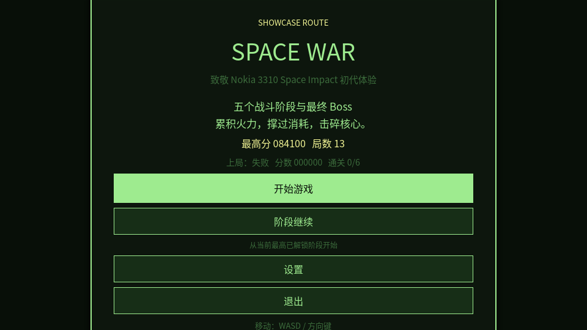
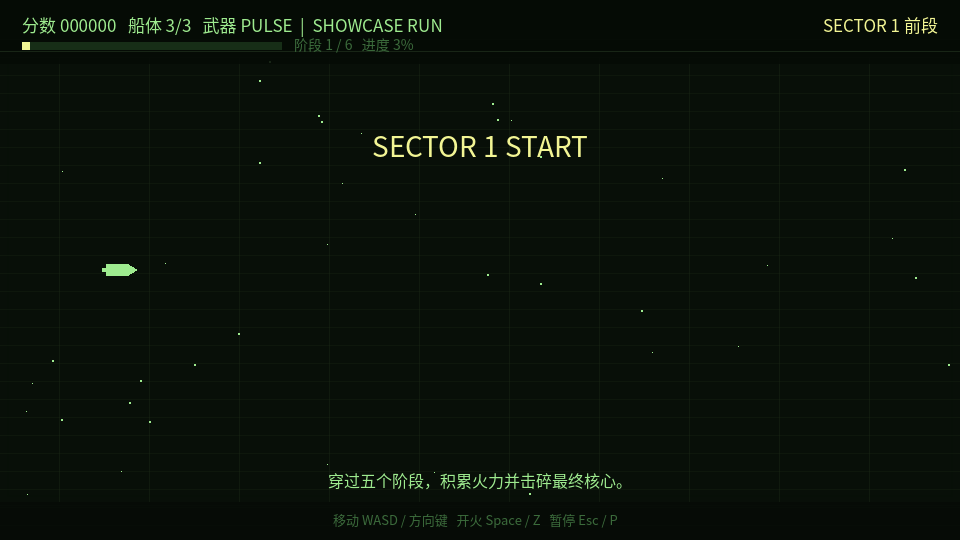
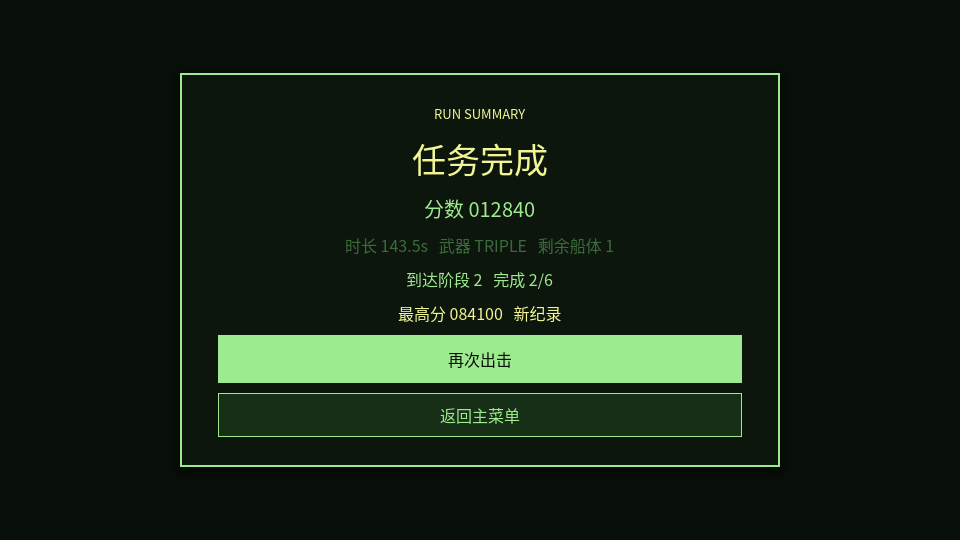

# Space War

一个使用 Godot 4.6.1 制作的 Nokia 3310《Space Impact》初代风格复刻 / 重制项目。

项目目标不是把它扩展成现代原创横版射击游戏，而是尽量还原原作最有辨识度的体验：

- 横向自动卷轴
- 短局高压的街机节奏
- 简洁直接的敌人编队
- 局内即时生效的强化拾取
- 明确的关底 Boss 压轴
- 单色 / 低彩 LCD 气质的视觉与 UI

## 当前状态

当前仓库已经处于“完整可玩、可展示、可继续维护”的阶段。

当前版本包含：

- 主菜单、阶段继续、设置与中英文切换
- 5 个常规 Sector 与最终 Boss 阶段
- 13 级武器成长与高阶持续主炮
- 多类基础敌人、后段扩展敌人与差异化 Boss
- 暂停、结算、最高分记录与完整回路
- 程序化音效与主菜单 / 战斗分离的复古音频氛围
- 从阶段 0 到阶段 4 的完整设计 / 技术 / 测试文档

## 截图

### 主菜单



### 战斗



### 结算



## 玩家流程

启动项目后，当前完整体验流程如下：

1. 进入主菜单
2. 查看最高分与最近一局结果
3. 选择开始新局或从已解锁阶段继续
4. 穿过 5 个常规 Sector，逐关击败 Boss
5. 进入最终 Boss 战 `FINAL CORE`
6. 通关或死亡后进入结算页
7. 选择重新开始或返回主菜单

## 操作

- 移动：`WASD` / 方向键
- 射击 / 确认：`Space` / `Z`
- 返回 / 取消：`Esc` / `X`
- 暂停：`Esc` / `P`

## 运行方式

### 环境要求

- Godot 4.6.1

### 本地运行

1. 用 Godot 4.6.1 打开仓库根目录
2. 导入项目
3. 运行主场景 `res://scenes/ui/main_menu.tscn`

项目默认入口已经配置在 [`project.godot`](project.godot)。

## 项目结构

```text
docs/            设计、技术、测试与收尾文档
scenes/          Godot 场景
scripts/         GDScript 逻辑
assets/          美术、字体、音频资源目录
tests/           预留测试目录
```

主要入口文件：

- 主菜单：[`scenes/ui/main_menu.tscn`](scenes/ui/main_menu.tscn)
- 战斗主场景：[`scenes/game/game_root.tscn`](scenes/game/game_root.tscn)
- 全局状态：[`scripts/autoload/game_session.gd`](scripts/autoload/game_session.gd)
- 音频控制：[`scripts/autoload/audio_director.gd`](scripts/autoload/audio_director.gd)

## 文档索引

完整开发记录位于 `docs/`：

- `00_project_brief.md`：项目目标与范围
- `01_reference_breakdown.md`：原作拆解与参考歧义
- `02_core_game_loop.md`：核心循环定义
- `03_gameplay_spec.md`：玩法规格
- `04_technical_design.md`：技术设计
- `05_art_audio_style.md`：美术与音频方向
- `06_production_plan.md`：阶段计划
- `07_test_plan.md`：测试计划
- `08_playtest_report.md`：试玩与验证记录
- `09_release_checklist.md`：发布检查表
- `10_postmortem.md`：项目复盘
- `11_release_notes_v1.0.0.md`：首个展示版发布文案
- `12_final_playtest_runbook.md`：最终人工试玩执行手册
- `13_release_notes_v1.0.1.md`：`v1.0.1` 发布文案
- `14_distribution_guide.md`：导出与分发说明
- `15_release_notes_v1.1.0.md`：`v1.1.0` 发布文案
- `16_final_summary.md`：项目正式完结总结
- `17_release_notes_v1.1.1.md`：`v1.1.1` 发布文案
- `18_post_release_backlog.md`：发布后维护与迭代清单

## 当前最接近原版的部分

- 紧凑直接的战斗节奏
- 敌人波次 + 强化 + Boss 的基础结构
- 克制的 HUD 与菜单信息层次
- 单色屏时代风格的几何化呈现

## 已知差异

当前版本已经足够接近 Nokia 3310 初代体验，但仍保留这些工程化取舍：

- 视觉与音频以程序化和占位风格为主，还没有使用更完整的定制资源
- 虽然敌人、关卡与平衡参数已开始拆分，但战斗主流程仍有继续轻量数据化空间
- 自动运行验证已完成，但人工完整试玩仍建议继续补充

## 适合仓库展示的定位

这是一个强调开发流程与完成度收口的复刻项目，适合用于：

- 展示 Godot 4 项目结构组织方式
- 展示“先文档、后实现、分阶段推进”的小型游戏开发流程
- 展示一个围绕经典手机游戏体验复刻的完整样例

## 版本

当前推荐用于正式发布的标签为：`v1.1.1`

详细发布说明见 [`CHANGELOG.md`](CHANGELOG.md)。

当前 Release 说明文案见 [`docs/17_release_notes_v1.1.1.md`](docs/17_release_notes_v1.1.1.md)。

已发布版本页面：

- [`v1.1.1 Release`](https://github.com/Drew-Z/space-impact/releases/tag/v1.1.1)

## 许可证

当前仓库已使用 [`Apache-2.0`](LICENSE) 许可证。

这意味着他人可以在遵守 Apache License 2.0 条款的前提下使用、修改和分发本项目。正式条款见仓库根目录下的 [`LICENSE`](LICENSE)。
